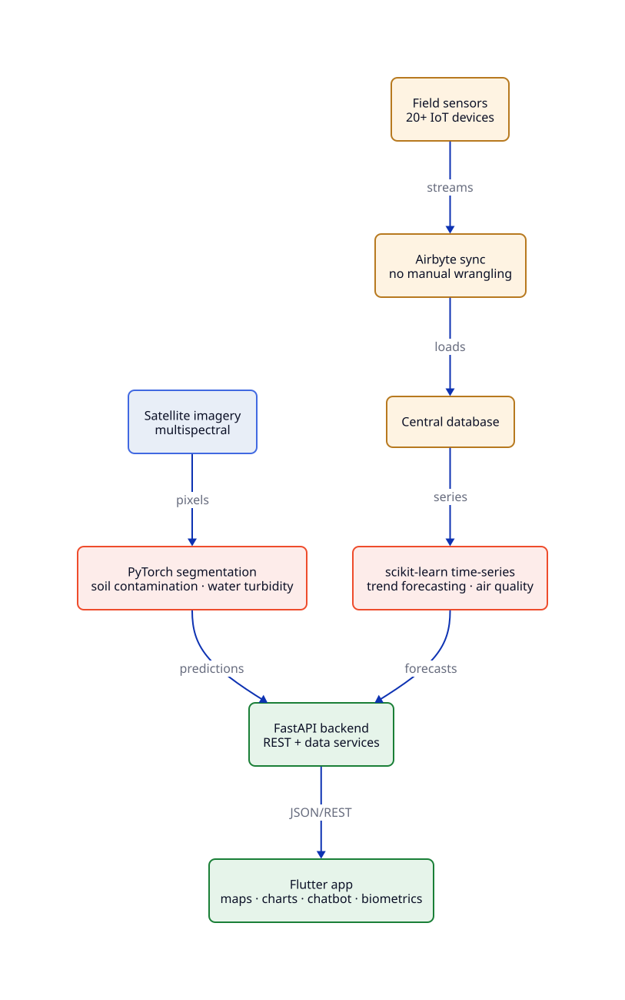

<h1 align="center">KORIA — GabèsEye</h1>

<p align="center">
  <b>Real-time environmental monitoring platform</b> — satellite imagery · IoT sensors · AI forecasting — H12 INNOVATION 3.0
</p>

<p align="center">
  
  
  
  
  
  
</p>

<p align="center">
  <sub>👋 Hi, I'm <a href="https://github.com/adriansalvadorekomo"><b>Adrian Salvador Ekomo</b></a> — Computer Engineering student building toward a <b>Junior Data Engineer</b> role. This repo is my proof of work.</sub>
</p>

---

## Contents

- [1. Project Overview](#1-project-overview)
- [2. Architecture](#2-architecture)
  - [System Architecture Diagram](#system-architecture-diagram)
  - [Diagram Sources (D2 · Graphviz)](#diagram-sources-d2--graphviz)
- [3. Features](#3-features)
- [4. Tech Stack](#4-tech-stack)
- [5. Getting Started](#5-getting-started)
- [6. Project Structure](#6-project-structure)
- [7. Conclusion](#7-conclusion)

---

## 1. Project Overview

Gabès lives with a paradox: heavy industry on one side, fragile coastline and farmland on the other. When soil, water, and air all need watching at once, nobody has a single screen to look at.

GabèsEye is our answer, built during the **H12 INNOVATION 3.0** national hackathon: an AI-powered environmental monitoring platform that fuses satellite remote sensing with ground-level IoT sensor data. PyTorch segmentation reads soil contamination and water turbidity from multispectral imagery, Airbyte syncs 20+ field devices with no manual wrangling, scikit-learn forecasts contamination and air-quality trends — and this repo, the cross-platform Flutter app, puts it all in the hands of farmers, fishermen, and authorities through maps, charts, and a multilingual chatbot.

- **Status:** Hackathon build — Android, iOS, Web, Linux, macOS, and Windows from one codebase.

---

## 2. Architecture

### System Architecture Diagram



*Satellite pixels and field-sensor streams converge through ML models into one
FastAPI backend serving the cross-platform Flutter app.*

### Diagram Sources (D2 · Graphviz)

The diagram is maintained as text — version-controlled, easy to update, with SVG committed for direct viewing.

- **D2 source** — [`docs/architecture.d2`](docs/architecture.d2), the preferred format for readability:
  `d2 docs/architecture.d2 docs/architecture.svg`
- **Graphviz (DOT) source** — [`docs/architecture.dot`](docs/architecture.dot), for broader compatibility:
  `dot -Tsvg docs/architecture.dot -o docs/architecture-gv.svg`

---

## 3. Features

| Feature | Details |
|---------|---------|
| 🛰 **Satellite Segmentation** | PyTorch models on multispectral imagery classify soil contamination and detect water turbidity |
| 🌊 **Water Quality** | Real-time turbidity monitoring with trend forecasting |
| 🌬 **Air Quality** | Predictive models for contamination levels and air quality index |
| 📊 **Interactive Dashboards** | Charts and maps powered by `fl_chart` and `flutter_map` |
| 🗺 **Geospatial Mapping** | OpenStreetMap integration with `latlong2` for field data visualization |
| 🤖 **AI Chatbot** | Multilingual natural language interface for querying environmental data |
| 🔐 **Secure Access** | Biometric authentication with `local_auth` |
| 🌐 **Multi-language** | Full internationalization support via `intl` and `flutter_localizations` |

---

## 4. Tech Stack

### Frontend (This Repo)

| Layer | Technology |
|-------|-----------|
| **Framework** | Flutter 3.x |
| **Language** | Dart 3.x |
| **State Management** | Provider |
| **Maps** | flutter_map + latlong2 |
| **Charts** | fl_chart |
| **Icons** | Cupertino Icons |
| **Typography** | Google Fonts |
| **Local Storage** | Shared Preferences |
| **Auth** | Local Authentication (biometrics) |
| **HTTP Client** | http package |
| **Animations** | Shimmer |

### Backend / ML (Separate)

| Component | Technology |
|-----------|-----------|
| **Satellite Segmentation** | PyTorch |
| **Time-Series Forecasting** | scikit-learn |
| **Data Integration** | Airbyte |
| **API** | FastAPI |
| **Database** | PostgreSQL |

---

## 5. Getting Started

### Prerequisites

- Flutter SDK ^3.10.8
- Dart SDK ^3.10.8
- An API endpoint running the FastAPI backend

### Run the App

```bash
# Clone the repository
git clone https://github.com/adriansalvadorekomo/KORIA.git
cd KORIA

# Get dependencies
flutter pub get

# Run the app
flutter run
```

The app supports **Android**, **iOS**, **Web**, **Linux**, **macOS**, and **Windows**.

---

## 6. Project Structure

```
lib/
├── data/         # Data layer (models, repositories)
├── l10n/         # Localization files
├── models/       # Data models
├── providers/    # State management (Provider)
├── screens/      # UI screens — role-based (farmer, fisherman, authority) + map, alerts, reports, drone
├── services/     # API services and business logic
├── theme/        # App theming
└── main.dart     # Entry point
```

---

## 7. Conclusion

GabèsEye taught me that environmental data is only as good as its last mile: satellites and sensors mean nothing if a farmer can't read the answer on a phone. This app is that last mile — one codebase, six platforms, three roles.

If you build systems where data has to survive contact with the real world, let's talk.

---

<p align="center">
  <sub>H12 INNOVATION 3.0 · Environmental Intelligence Through AI & Data Engineering</sub>
  <br />
  <sub>👋 <a href="https://github.com/adriansalvadorekomo"><b>Adrian Salvador Ekomo</b></a> · <a href="https://linkedin.com/in/adrian-salvador-ekomo-mesi-obono-5990b8182">LinkedIn</a> · seeking a Junior Data Engineer role</sub>
</p>
