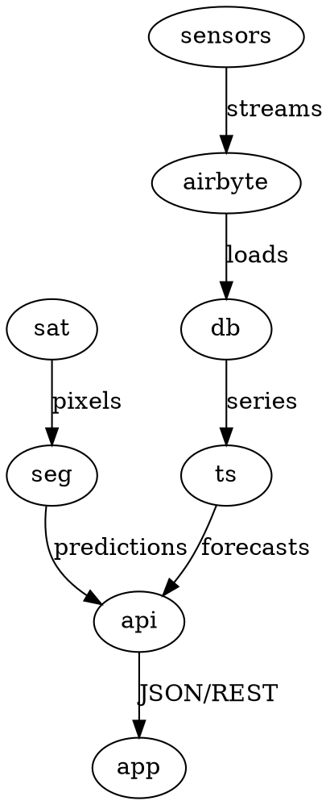

<h1 align="center">KORIA — GabèsEye</h1>

<p align="center">
  <b>AI-powered environmental monitoring platform</b> — H12 INNOVATION 3.0
</p>

<p align="center">
  
  
  
  
  
  
</p>

---

## Overview

**GabèsEye** is a cross-platform environmental surveillance application developed during the **H12 INNOVATION 3.0** national hackathon. It combines satellite imagery analysis, real-time sensor data, and AI-powered forecasting to deliver actionable environmental intelligence.

The system monitors soil contamination, water turbidity, and air quality — giving field teams and researchers a real-time dashboard for environmental decision-making.

---

## Architecture


*Satellite pixels and field-sensor streams converge through ML models into one
FastAPI backend serving the cross-platform Flutter app.*

<details>
<summary><b>Diagram sources (D2 · Graphviz)</b></summary>

- [`docs/architecture.d2`](docs/architecture.d2) — render with `d2 docs/architecture.d2 docs/architecture.svg`
- [`docs/architecture.dot`](docs/architecture.dot) — render with `dot -Tsvg docs/architecture.dot -o docs/architecture-gv.svg`

```d2
direction: down

sat: "Satellite imagery\nmultispectral"
seg: "PyTorch segmentation\nsoil contamination · water turbidity"
sensors: "Field sensors\n20+ IoT devices"
airbyte: "Airbyte sync\nno manual wrangling"
db: "Central database"
ts: "scikit-learn time-series\ntrend forecasting · air quality"
api: "FastAPI backend\nREST + data services"
app: "Flutter app\nmaps · charts · chatbot · biometrics"

sat -> seg: pixels
sensors -> airbyte: streams
airbyte -> db: loads
seg -> api: predictions
db -> ts: series
ts -> api: forecasts
api -> app: JSON/REST
```



</details>

---

## Features

| Feature | Details |
|---------|---------|
| 🛰 **Satellite Segmentation** | PyTorch models on multispectral imagery classify soil contamination and detect water turbidity |
| 🌊 **Water Quality** | Real-time turbidity monitoring with trend forecasting |
| 🌬 **Air Quality** | Predictive models for contamination levels and air quality index |
| 📊 **Interactive Dashboards** | Charts and maps powered by `fl_chart` and `flutter_map` |
| 🗺 **Geospatial Mapping** | OpenStreetMap integration with `latlong2` for field data visualization |
| 🤖 **AI Chatbot** | Multilingual natural language interface for querying environmental data |
| 🔐 **Secure Access** | Biometric authentication with `local_auth` |
| 🌐 **Multi-language** | Full internationalization support via `intl` and `flutter_localizations` |

---

## Tech Stack

### Frontend (This Repo)

| Layer | Technology |
|-------|-----------|
| **Framework** | Flutter 3.x |
| **Language** | Dart 3.x |
| **State Management** | Provider |
| **Maps** | flutter_map + latlong2 |
| **Charts** | fl_chart |
| **Icons** | Cupertino Icons |
| **Typography** | Google Fonts |
| **Local Storage** | Shared Preferences |
| **Auth** | Local Authentication (biometrics) |
| **HTTP Client** | http package |
| **Animations** | Shimmer |

### Backend / ML (Separate)

| Component | Technology |
|-----------|-----------|
| **Satellite Segmentation** | PyTorch |
| **Time-Series Forecasting** | scikit-learn |
| **Data Integration** | Airbyte |
| **API** | FastAPI |
| **Database** | PostgreSQL |

---

## Getting Started

### Prerequisites

- Flutter SDK ^3.10.8
- Dart SDK ^3.10.8
- An API endpoint running the FastAPI backend

### Run the App

```bash
# Clone the repository
git clone https://github.com/adriansalvadorekomo/KORIA.git
cd KORIA

# Get dependencies
flutter pub get

# Run the app
flutter run
```

The app supports **Android**, **iOS**, **Web**, **Linux**, **macOS**, and **Windows**.

---

## Project Structure

```
lib/
├── data/         # Data layer (models, repositories)
├── l10n/         # Localization files
├── models/       # Data models
├── providers/    # State management (Provider)
├── screens/      # UI screens
├── services/     # API services and business logic
├── theme/        # App theming
└── main.dart     # Entry point
```

---

## Hackathon Context

Built for **H12 INNOVATION 3.0** — a national innovation hackathon focused on environmental technology. The project was designed to address real environmental monitoring challenges in the Gabès region, combining satellite remote sensing with ground-level IoT sensor data for comprehensive environmental surveillance.

---

<p align="center">
  <sub>H12 INNOVATION 3.0 · Environmental Intelligence Through AI & Data Engineering</sub>
</p>
